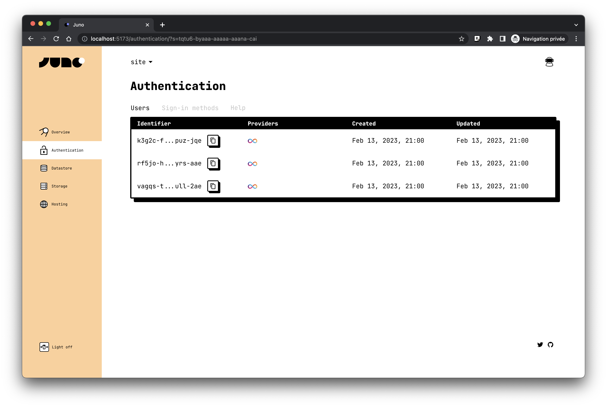
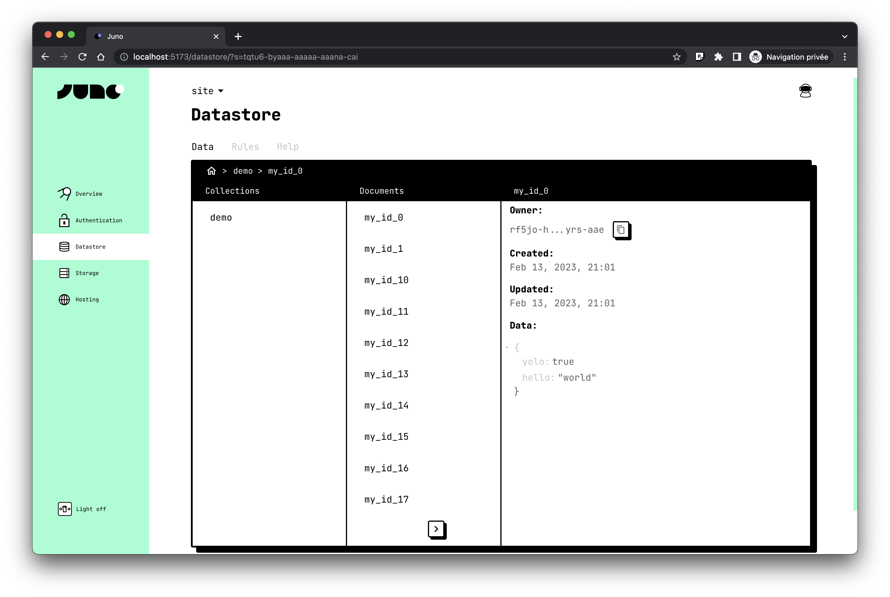

I am thrilled to introduce [Juno](https://juno.build), a groundbreaking open-source Blockchain-as-a-Service solution that makes building Web3 applications more accessible to the millions of front-end developers worldwide.


---

## What is Juno?

Unlike traditional Backend-as-a-Service (BaaS) platforms like Google Firebase or AWS Amplify, Juno runs entirely on the blockchain.

It allows you to forget about all the backend aspects of development, letting focus on what matters: the product your users see.

At Juno, privacy is a top priority and the platform operates without controlling your data or work. With Juno, you truly own your creations.

The Juno closed beta program is launching today and is packed with all the essential features you need to start creating Web3 applications.

---

## How It Works

Every project you create on Juno is a "Satellite": a smart contract that you own, running 100% on-chain. 🛰️

It is a container for your application that holds all your project's state: users' persisted data, asset storage (images or video) and your application bundle.

A satellite lives on its own -- and only _you_ can administrate it, because you _own_ it, exactly like an NFT.

In the future it will be enhanced with further capabilities and we might launch other extended canisters such as "Rocket" or "Space station".

We also plan to open the platform to third party developers allowing them to provide and sell their own templates.

---

## Authentication

Juno allows developers to securely identify users anonymously and save their data on the blockchain.

Our easy-to-use SDKs support authentication via [Internet Identity](https://internetcomputer.org/internet-identity), a Web3 authentication provider that offers a secure blockchain login experience with a user-friendly Web2 interface, and more providers will be added soon.

Juno Authentication integrates tightly with other services, [datastore](https://juno.build/docs/build/datastore) and [storage](https://juno.build/docs/build/storage).

```javascript
import { signIn } from '@junobuild/core';

const btn = document.querySelector("#signin");
btn?.addEventListener("click", signIn, { passive: true });
```



---

## Datastore

Juno Datastore can be use to add persistency to your application. It uses a simple principle of collections and documents.

Each collections can handle which users and/or administrators have access to their data. Juno has never access to these and it is also worth to note that if you wish, you can also design your architecture in a way that even you the developer of your application can have no access to the data saved by your users.

```typescript
import { getDoc, setDoc } from '@junobuild/core';

const collection = "my_collection";
const key = "my_key";

const doc = await getDoc({
  collection,
  key
});

await setDoc({
  collection,
  doc: {
   key,
   ...(doc && doc),
   data: {
    email: myNewEmail
   }
  }
});
```



---

## Storage

Juno Storage is the easiest way to let your users upload and manage their files securely on blockchain. The API we provide is designed to obfuscate any potential complexity. It takes advantage of the same read and write permission concept as the Datastore and automatically makes the file available on the Internet with the help of a built-in query parameters "token" mechanism that can be use to make users files secret.

```javascript
const input = document.querySelector("input");

const {downloadUrl} = await uploadFile({
    data: input.files[0],
    collection: 'images'
});
```


---

## Hosting

Juno Hosting - as for our other services - runs on the Internet Computer network. It is the only blockchain with canister smart contracts that can serve web and thus, without relying on any Big Tech infrastructure.

Therefore, the "Satellites" launch on Juno run entirely on blockchain, which allows for full decentralization.

You can also maintain your unique brand identity with Juno Hosting as custom domain name are fully supported and can be configured with ease.


---

## What's next?

We are starting our closed beta program today. Fill this form - build with Juno - to enter the waiting list or contact David on [Twitter](https://daviddalbusco.com) (if you cannot wait to give Juno a try 😉).

GitHub Star are also warmly welcomed. Drop a ⭐️ on our [GitHub repo](https://github.com/buildwithjuno/juno).
